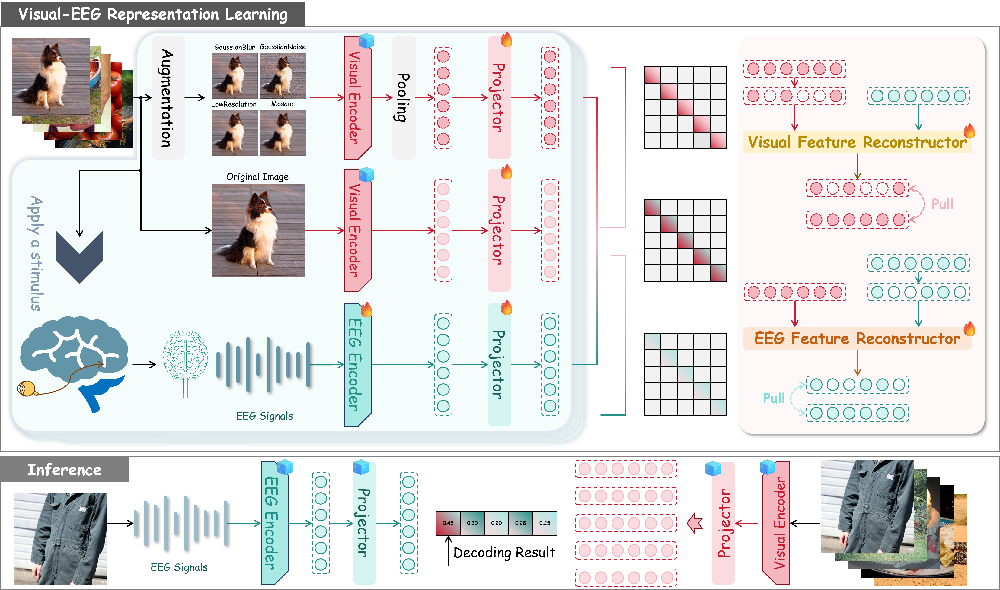

# SSR
[Under review] Official repository for "Semantic-anchored Cross-modal Reconstruction for Generalizable Brain Decoding"

Decoding visual information from brain activity is a fundamental yet challenging problem in cognitive neuroscience and artificial intelligence, due to the intrinsic noise and substantial intersubject variability of brain signals. Existing retrieval-based brain decoding methods rely on image augmentations of visual stimuli to simulate cognitive priors in human brain visual information processing and capture cross-modal association by maximizing feature similarity between visual stimuli and brain responses. Despite some progress, these practices raise two issues. First, pixel-level perturbations distort the discriminative semantics of visual stimuli and weaken inter-stimulus distinction, leading to learned brain representations with insufficient discriminability. Second, similarity-based contrastive learning is inherently vulnerable to learning spurious correlations from the high-variability brain signals, compromising the robustness of cross-modal correspondence and limiting model generalization. To address these issues, we propose a Semantic-anchored framework for learning brain representations with croSs-modal Reconstruction (SSR). Specifically, to obtain visual stimulus features that are both semantically compact and aligned with cognitive priors, we first construct a feature triplet consisting of a brain, an original image, and an augmented image, and then perform contrastive learning based on the triplet with the original image as semantic anchor, enhancing the discriminative power of learned brain representations. Furthermore, inspired by the brain's predictive coding mechanism, we design a cross-modal masked reconstruction module. Aiming beyond direct similarity maximization, the module learns to reconstruct masked features via cross-modal context, which requires inferring inter-modal dependencies and thus fosters robust, generalizable associations resilient to noise. Extensive experiments demonstrate that our framework significantly enhances both the discrimination and generalizability of brain representations, achieving state-of-the-art performance on two popular brain decoding benchmarks.

# Overreview
  
This paper's framework first simulates cognitive priors by enhancing visual stimuli with augmentations, then uses original image features as semantic anchors to perform triple contrastive learning, acquiring semantic-enhanced visual features with cognitive priors for learning discriminative brain representations. Subsequently, robust cross-modal associations resilient to brain signal noise are established through cross-modal masked reconstruction, optimizing zero-shot decoding. During the inference phase, based on feature similarity, the original visual stimuli are retrieved by directly decoding unseen brain signals.

